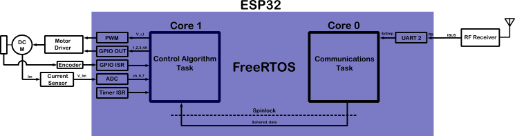
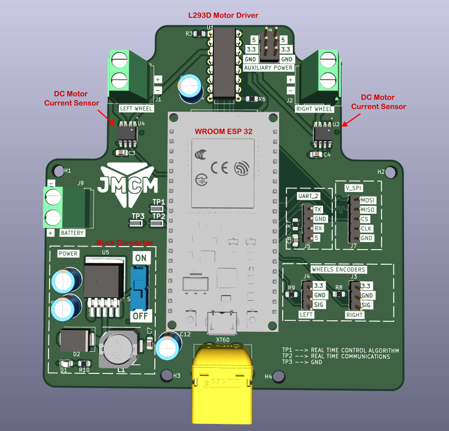
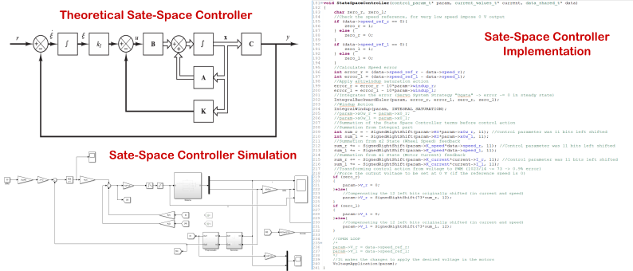

# OpenHardware
In this repository I will upload open hardware projects made by me from time to time.

## Rover Speed Controller
In this project I have developed a rover speed controller using a multicore embedded system (ESP32), the core 0 is managing the communication tasks (decoding the wheels speed reference given by a RF receiver) and the core 1 is managing the control algorithm.

The control algorithm used is a "Linear-Quadratic Regulator" (LQR), it is an State-Space Controller (the rover is a MIMO system) based on "Optimal Control Theory". The communication between the cores is managed by a Real Time Operating System (FreeRTOS). 

Inside the folder "RoverSpeedControl" you can find the Matlab/Simulink files to modelate the system, design and tune the LQR controller, the schematic to understand how the hardware is designed, gerber files to manufacture a copy of the hardware, Bill Of Materials (BOM) file to buy the electronic components and source files to program the ESP32 with the algorithms to run it as I did.

### Images of the project
Pictures of the device finished.

High-Level Architecture System Diagram.

Picture of the "Computer-Aided Design" (CAD) 3D Model given by Kicad EDA.

Linear-Quadratic Regulator controller, from theory to implementation.

## Differential Probe
In this project I have developed a differential probe for my oscilloscope (ADP3450). The device is capable of measuring a voltage range between +- 500V, the user can change the scale from x100 to x10 (reducing the full scale range to +- 50V). The bandwith of the probe is around 10 MHz. Inside the directory people can find the schematic, gerber files and LTspice models to analyce the analog circuitry.

### Images of the project
3D Model given by Kicad EDA.

The device in reality after the manufacturing process.

Simulated behaviour using the LTspice software.

Real behaviour doing a test with the ADP3450.

Test setup.

